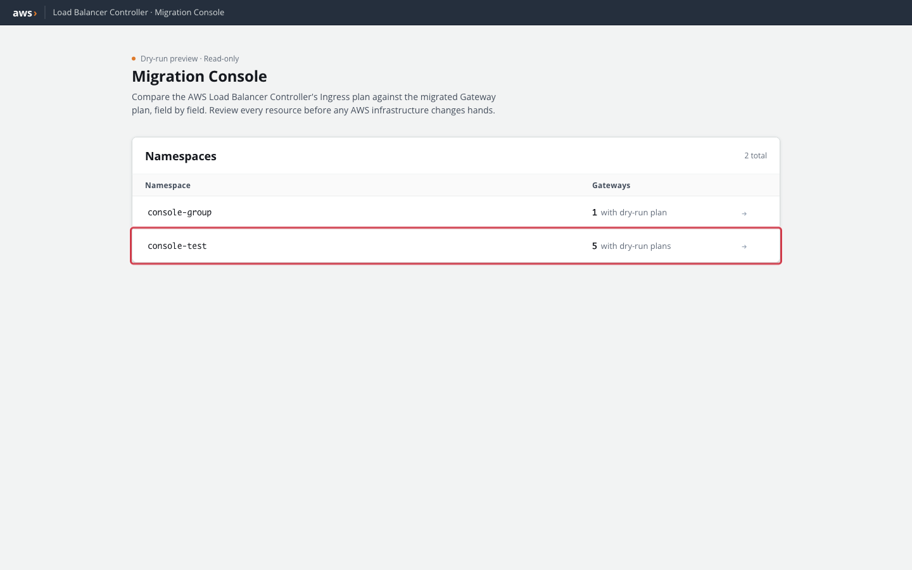
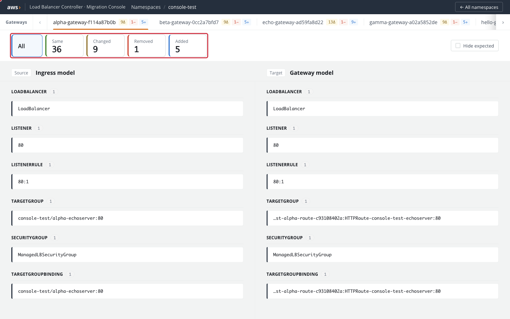
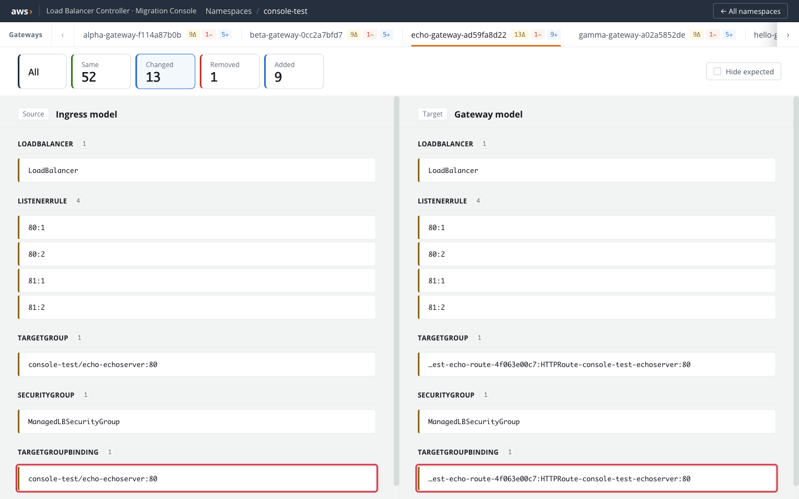
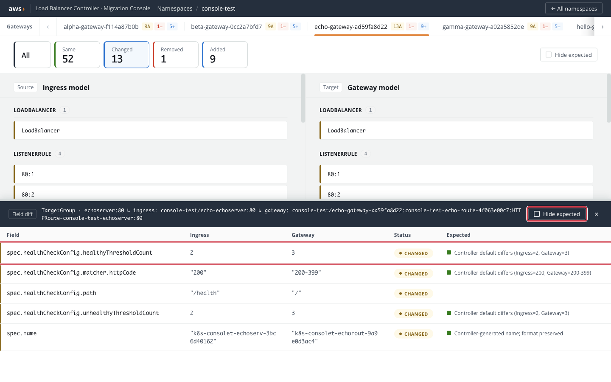

# In-Cluster Migration Console

<!--
Screenshot assets live in docs/guide/gateway/assets/.
When regenerating, keep these rules in mind:
  - Blur or scrub AWS account IDs, ARNs, certificate ARNs, subnet IDs,
    security group IDs, tokens, and any real domain hostnames. Cluster names
    may stay visible.
  - Use a red rectangle (no blur) to highlight the element each caption
    calls out.

Captured images:

  1. console/landing.png
       Landing page at http://localhost:8080.
       Highlight: a namespace row and its gateway count.

  2. console/comparison-overview.png
       Comparison view for a namespace with multiple gateway tabs at top.
       Highlight: metric chips row (all / same / changed / removed / added)
       and the "Hide expected" toggle in the upper right.

  3. console/resource-cards.png
       Ingress (left) and Gateway (right) columns with the "Changed" filter
       active so status coloring is visible. Highlight: the TargetGroupBinding
       card on each side so the pairing is obvious.

  4. console/detail-drawer.png
       Field-level drawer opened for a TargetGroup so the health-check
       default-drift rows are visible. Highlight: the drawer's per-resource
       "Hide expected" checkbox and an expected row.
-->

!!! warning "Under Development"
    The migration tool and its console are under active development.
    Features may change.

The migration console is a local web UI bundled into the `lbc-migrate` binary.
It compares the ingress controller's dry-run plan against the gateway controller's
dry-run plan side by side, field by field, so you can confirm the generated
Gateway manifests behave the same as the current Ingress before switching traffic.

The console is read-only. It lists Gateways and reads annotations from your
cluster using your current kubeconfig context. It never creates, updates, or
deletes cluster or AWS resources.

## What it supports

- **Cluster-wide discovery** of namespaces that hold dry-run Gateways,
  each paired with its source Ingress via the `gateway.k8s.aws/migrated-from`
  tag.
- **Side-by-side comparison** of the full built model stack — LoadBalancer,
  Listeners, ListenerRules, TargetGroups, TargetGroupBindings, SecurityGroups —
  produced by each controller.
- **Field-level diff** with four statuses: `same`, `changed`, `added`, `removed`.
  Slice fields (e.g. SecurityGroup ingress rules) are compared as multisets.
- **Expected-diff filtering** that hides known migration artifacts (migrated-from
  tag, controller-generated names, health-check default drift, forward weights,
  `targetGroupARN.$ref` pointer churn) so genuine user-visible changes stand out.
- **Resource correlation across controllers**: `TargetGroup` and
  `TargetGroupBinding` are keyed by `serviceRef.name:port` so the same backing
  service shows as one correlated row instead of a removed+added pair, even
  though the two controllers generate different raw stack IDs.
- **IngressGroup resolution** including cross-namespace groups, using the
  `migrated-from` tag plus a cluster-wide list of Ingresses to locate the single
  group member that carries the plan annotation.

What it does not do:

- It does not call AWS or check live resource state. It only diffs the two
  dry-run plans.
- It does not have a namespace-scoped mode. Cross-namespace ingress groups
  require cluster-wide list permission on Ingresses and Gateways.
- It does not modify any Kubernetes or AWS resource.

## End-to-end dry-run workflow

The console is the last step of a four-step preview flow. Each step populates
or consumes a specific annotation; nothing talks to AWS until the final cutover.

### 1. Enable the ingress plan annotation

On the AWS Load Balancer Controller, enable the feature gate:

```
--feature-gates=IngressPlanAnnotation=true
```

This is off by default. Once enabled, the ingress controller writes its
built model stack to each reconciled Ingress as
`alb.ingress.kubernetes.io/dry-run-plan` on every reconcile.

!!! note "IngressGroup behavior"
    For an IngressGroup, all members share one plan. To avoid duplication, the
    controller writes the annotation only to the primary member — the one
    with the lowest `alb.ingress.kubernetes.io/group.order`, tie-broken by
    lexical order of `<namespace>/<name>`. Other members of the group carry
    no plan annotation; the controller actively clears the annotation from
    non-primary members so the console always sees exactly one holder per
    group. The console resolves the holder automatically via the
    `migrated-from` tag.

### 2. Generate the Gateway manifest

Run `lbc-migrate` against your Ingresses. Dry-run is the default, so every
generated Gateway carries `gateway.k8s.aws/dry-run: "true"`:

```bash
lbc-migrate --from-cluster --namespace production --output-dir ./gw/
```

See [Migrate from Ingress](migrate_from_ingress.md) for the full set of input
modes and flags.

### 3. Apply the manifest

```bash
kubectl apply -f ./gw/gateway-resources.yaml
```

Because the Gateways carry the dry-run annotation, the gateway controller
builds the full built model but does **not** create an ALB. It writes the
serialized plan back to the Gateway as `gateway.k8s.aws/dry-run-plan`.

At this point both controllers have attached their plans as annotations on
their respective resources. No AWS resource has been created.

### 4. Launch the console

```bash
lbc-migrate --console
# or bind to a different port
lbc-migrate --console --port 9000
```

The console binds to `http://localhost:8080` by default and operates cluster-wide
using your current kubeconfig context. Open that URL in a browser.

## Using the console

### Landing page

The landing page lists every namespace that has at least one Gateway carrying
a `gateway.k8s.aws/dry-run-plan` annotation, with a count of those Gateways.
Namespaces without dry-run plans do not appear.



Click a namespace to enter the comparison view.

### Comparison view

The comparison view shows one tab per Gateway in the selected namespace. For
the active Gateway, the view is organized into three regions:



- **Metric chips** — counts of fields per status (`same`, `changed`, `removed`,
  `added`) plus an `all` chip to reset the filter. Click a chip to scope the
  view to only fields in that status.
- **Hide expected toggle** (upper right) — filters out diffs classified as
  expected migration artifacts (see [How diffs are classified](#how-diffs-are-classified)
  below). Works in combination with the active status filter.
- **Ingress model** (left) and **Gateway model** (right) — each resource in the
  stack appears as a card colored by its status.



Click a card to open the detail drawer. The drawer lists every field with its
ingress-side value, gateway-side value, and status. It carries its own
`Hide expected` checkbox for per-resource filtering.



### How resources are correlated

Resources are matched across the two plans by a correlation key:

- For most resource types the raw stack ID is stable, so the key is the ID itself.
- For `TargetGroup` and `TargetGroupBinding` the two controllers generate
  different raw IDs even when pointing at the same backing service. The console
  keys these on the TGB's `serviceRef.name:port`, producing a single correlated
  row with field-level diffs instead of a removed+added pair.

### How diffs are classified

Every field diff is assigned one of four statuses:

- **same** — both sides produce the same value. Slice fields are compared as
  multisets (`[80, 81]` equals `[81, 80]`) because ALB treats things like
  SecurityGroup ingress rules as unordered.
- **changed** — both sides have the field, values differ.
- **added** — only the gateway side has the field.
- **removed** — only the ingress side has the field.

The `Hide expected` toggle filters out the following known-artifact cases:

- **`migrated-from` tag added to any resource** — the migration tool stamps
  `spec.tags.gateway.k8s.aws/migrated-from` on every generated resource, so an
  `added` entry for this tag is expected on the gateway side.
- **Controller-generated name change on ALB-family resources** — `spec.name` on
  `LoadBalancer` and `TargetGroup`, `spec.groupName` on `SecurityGroup`, and
  `spec.template.metadata.name` on `TargetGroupBinding`. Marked expected only
  when both sides match the controller-generated format (`k8s-<...>-<10 hex>`,
  two or three dash sections before the suffix). A custom name set via
  annotation on either side still surfaces as a real changed diff.
- **Health-check default drift on TargetGroup** —
  `spec.healthCheckConfig.healthyThresholdCount`,
  `spec.healthCheckConfig.unhealthyThresholdCount`, and
  `spec.healthCheckConfig.matcher.httpCode`. The ingress controller defaults
  to 2 / 2 / 200; the gateway controller defaults to 3 / 3 / 200–399.
- **`weight` added on ListenerRule forward actions** — any field under
  `forwardConfig.targetGroups[...]` ending in `.weight`. The gateway controller
  always emits a weight on every forward target group; the ingress controller
  omits it.
- **`targetGroupARN.$ref` string change** — on ListenerRule
  (`forwardConfig.targetGroups[...].targetGroupARN.$ref`) and on
  TargetGroupBinding (`spec.template.spec.targetGroupARN.$ref`). These `$ref`
  values are JSON pointers into another resource's raw stack ID; the stack
  IDs differ per controller even when they point at the same backing service,
  so the string always differs. Real target-group differences surface on the
  correlated `TargetGroup` row.

Everything not matching these rules is shown as-is, so genuine user-visible
changes are never silently hidden.

### Resolving the ingress source for a Gateway

Each Gateway is paired with the Ingress that holds its dry-run plan. The
console derives the pairing from the `gateway.k8s.aws/migrated-from` tag on
the LoadBalancer resource of every generated plan:

- `ingress/<namespace>/<name>` — standalone Ingress, direct pointer.
- `ingress-group/<group-name>` — the console lists Ingresses cluster-wide,
  filters by `alb.ingress.kubernetes.io/group.name == <group-name>`, and
  returns whichever member currently carries a non-empty `dry-run-plan`
  annotation.

On a healthy group, exactly one member holds the plan. If the console finds
zero or more than one, it surfaces an error on the Gateway card.

## RBAC

The console needs these permissions in the context it runs under:

- Cluster-wide `list` on `gateways.gateway.networking.k8s.io` — for the landing
  page and per-namespace gateway lists.
- Cluster-wide `list` on `ingresses.networking.k8s.io` — for resolving group
  plan holders, since ingress groups can span namespaces.
- `get` on `ingresses.networking.k8s.io` in any namespace that appears on the
  landing page — to read the plan annotation once the holder is resolved.

## Troubleshooting

**"could not determine ingress plan holder: no migrated-from tag found on
LoadBalancer in gateway model"** — the Gateway's dry-run plan lacks a
`migrated-from` tag, which means it was not generated by `lbc-migrate`.
Confirm you applied the output of `lbc-migrate` and not a hand-authored
Gateway.

**"no ingress in group `<name>` carries a dry-run-plan annotation"** — the
ingress controller has not yet written the plan annotation for any member of
that group. Confirm the `IngressPlanAnnotation` feature gate is enabled and
the ingress controller has reconciled the group at least once.

**"multiple ingresses in group `<name>` carry a dry-run-plan annotation"** —
usually a stale annotation left behind after group membership changed.
Manually clear the annotation from all but one member and refresh the console.

**Empty drawer / browser shows stale content** — the console's static assets
are embedded in the binary, so after upgrading `lbc-migrate` you need to
restart it and hard-refresh the browser (DevTools → Network → Disable cache,
or Cmd/Ctrl+Shift+R).

## Limitations

- The console does not verify AWS resource state. It only compares the two
  dry-run plans.
- Cross-namespace explicit groups require cluster-wide list permission on
  Ingresses (see [RBAC](#rbac)). There is no namespace-scoped mode.
