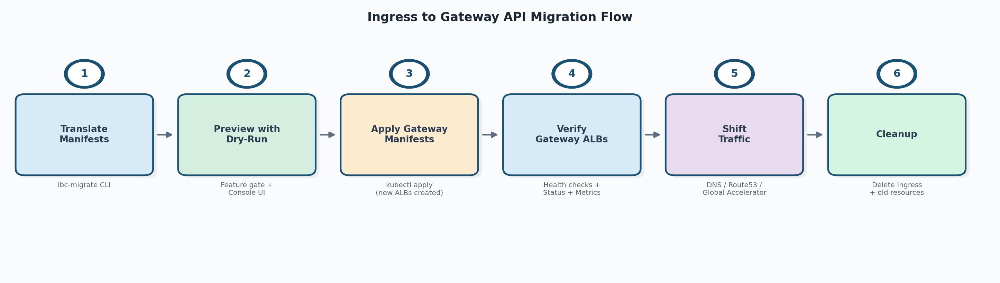
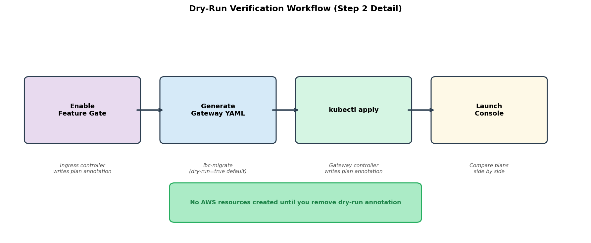
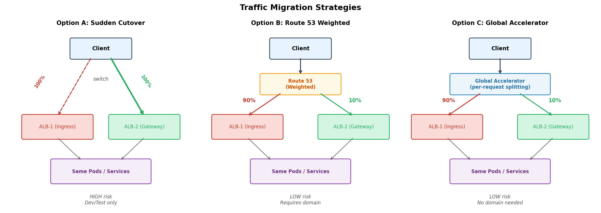

# Migrate from Ingress to Gateway API

!!! warning "Under Development"
    This tool is under active development.
    Features may change, and not all annotation translations are implemented yet.

This guide covers migrating AWS Load Balancer Controller (LBC) Ingress resources to Gateway API, step by step. The migration is designed to be safe and non-disruptive — new ALBs are created alongside existing ones, so current workloads stay running throughout the process.

Two tools are provided to help:

- **[`lbc-migrate` CLI](lbc_migrate_reference.md)** — translates Ingress manifests (annotations, rules, groups) into equivalent Gateway API YAML.
- **[Migration Console](in_cluster_console.md)** — a local web UI that compares the AWS resource plans produced by both the ingress and gateway controllers field by field, to verify equivalence before applying Gateway manifests for real.

## Overview

The migration follows six steps. Each step is safe to pause at — you can stop and resume at any point.



| Step | Action | What happens | Rollback |
|------|--------|--------------|----------|
| 1 | Translate manifests | `lbc-migrate` converts Ingress YAML to Gateway API YAML | Delete generated files |
| 2 | Preview with dry-run | Ingress controller writes its plan to annotation (requires feature gate). Gateway manifests applied with dry-run — gateway controller writes its plan without creating AWS resources. Console compares both plans. | Delete the dry-run Gateway |
| 3 | Apply Gateway manifests | LBC creates new ALBs for the Gateway resources alongside existing Ingress ALBs | Delete Gateway resources |
| 4 | Verify Gateway ALBs | Confirm new ALBs are healthy, configurations are correct, and metrics look normal | — |
| 5 | Shift traffic | Gradually move traffic from Ingress ALBs to Gateway ALBs | Shift traffic back |
| 6 | Cleanup | Delete Ingress and old resources | — |

!!! important "What changes and what stays the same"
    The generated output **replaces only your Ingress resource**. Everything else stays untouched:

    - **Namespace** — already exists, no changes needed.
    - **Deployment** — unchanged, continues running your application pods.
    - **Service** — unchanged, the new HTTPRoute `backendRefs` reference it by name.


## Prerequisites

- AWS Load Balancer Controller installed in the cluster with Gateway API support enabled
- The [Gateway API CRDs](https://gateway-api.sigs.k8s.io/guides/getting-started/#installing-gateway-api) installed at a compatible version (see [Gateway API documentation](gateway.md))
- `lbc-migrate` binary built (see [Installation](lbc_migrate_reference.md#installation))
- The tool assumes input Ingress resources are valid and currently working with the AWS Load Balancer Controller. It does not re-validate Ingress annotations.

---

## Step 1: Translate Manifests

First, install the `lbc-migrate` CLI if you haven't already:

```bash
# Build from the aws-load-balancer-controller repo
make lbc-migrate

# (Optional) Install on your PATH
make install-lbc-migrate
```

See [Installation](lbc_migrate_reference.md#installation) for details.

Then run `lbc-migrate` to convert your Ingress resources to Gateway API equivalents.

### Quick start

```bash
# From YAML files
lbc-migrate -f ingress.yaml --output-dir ./gw/

# From a directory of manifests
lbc-migrate --input-dir ./k8s-manifests/ --output-dir ./gw/

# From a live cluster (recommended — automatically fetches referenced Services, IngressClass, etc.)
lbc-migrate --from-cluster --namespaces production --output-dir ./gw/
```

The tool generates Gateway, HTTPRoute, GatewayClass, and optional CRD resources (LoadBalancerConfiguration, TargetGroupConfiguration, ListenerRuleConfiguration).

!!! tip "Use `--from-cluster` for best results"
    File-based input may miss Service-level annotations and IngressClassParams overrides. `--from-cluster` automatically fetches all referenced resources for the most accurate translation.

**Output:** A directory of Gateway API YAML files ready to apply. By default, `--dry-run=true` is set, so the generated Gateway manifests include the `gateway.k8s.aws/dry-run: "true"` annotation.

For the full CLI reference (all flags, output formats, split modes, IngressGroup handling, annotation support table), see **[Migration Tool (lbc-migrate)](lbc_migrate_reference.md)**.

---

## Step 2: Preview with Dry-Run

Before creating any AWS resources, verify that the generated Gateway manifests will produce the same ALB configuration as your current Ingress.



### 2a. Enable the Ingress plan annotation

On the AWS Load Balancer Controller, enable the feature gate:

```
--feature-gates=IngressPlanAnnotation=true
```

Once enabled, the ingress controller writes its built model stack to each reconciled Ingress as `alb.ingress.kubernetes.io/dry-run-plan`.

!!! note "IngressGroup behavior"
    For an IngressGroup, all members share one plan. The controller writes the annotation only to the primary member (lowest `group.order`, tie-broken by lexical `namespace/name`).

### 2b. Apply the generated Gateway manifests

```bash
kubectl apply -f ./gw/gateway-resources.yaml
```

Because the Gateways carry `gateway.k8s.aws/dry-run: "true"`, the gateway controller builds its model but does **not** create an ALB. It writes the plan back to the Gateway as `gateway.k8s.aws/dry-run-plan`. **No AWS resources are created.**

### 2c. Launch the migration console

```bash
lbc-migrate --console
# or bind to a different port
lbc-migrate --console --port 9000
```

Open `http://localhost:8080` in your browser. The console reads both plan annotations and shows a field-by-field comparison of every AWS resource (LoadBalancer, Listeners, ListenerRules, TargetGroups, SecurityGroups) that each controller would create.

The console is read-only and uses your current kubeconfig context — it never modifies any cluster or AWS resources.

Look for:

- **"Changed" diffs** — fields that differ between ingress and gateway plans. Known migration artifacts (naming changes, health-check defaults) are filtered by default.
- **"Added" / "Removed"** — resources or fields present on only one side.

!!! success "When to proceed"
    Review the diffs and confirm they are expected. Some differences are intentional (e.g., you deliberately changed a health-check path). As long as you understand and accept all listed changes, you can proceed to Step 3.

For the full console walkthrough (UI guide, diff classification, export, RBAC, troubleshooting), see **[Migration Console](in_cluster_console.md)**.

### 2d. (Optional) Inspect the raw plan

You can also inspect the plan annotation directly:

```bash
kubectl get gateway my-gateway \
  -o jsonpath='{.metadata.annotations.gateway\.k8s\.aws/dry-run-plan}' | jq .
```

---

## Step 3: Apply Gateway Manifests

Once you've confirmed the dry-run plan matches, regenerate the manifests without dry-run and apply:

```bash
# Regenerate without dry-run
lbc-migrate --from-cluster --namespaces production --output-dir ./gw/ --dry-run=false

# Apply
kubectl apply -f ./gw/gateway-resources.yaml
```

Alternatively, remove the dry-run annotation from the existing Gateway:

```bash
kubectl annotate -n <NAMESPACE> gateway <GATEWAY_NAME> gateway.k8s.aws/dry-run-
```

**What happens:**

- LBC creates **new ALBs** for the Gateway resources (one per Gateway object)
- LBC creates new Target Groups pointing to the **same** Services/Pods
- Both your existing Ingress ALBs and the new Gateway ALBs now route to the same backend Pods
- Existing Ingress ALBs continue working as before — no disruption

!!! note "Service reuse"
    Gateway API HTTPRoute `backendRefs` point directly to your existing Kubernetes Services. No new Services, Deployments, or Pods are created. Both sets of ALBs register the same pod IPs.

---

## Step 4: Verify Gateway ALBs

Before shifting traffic, confirm the new Gateway ALBs are healthy and correctly configured.

### Check Gateway status

```bash
kubectl get gateway <GATEWAY_NAME> -n <NAMESPACE>
```

Look for:

- `Programmed: True` condition — the ALB is fully provisioned
- `status.addresses` — contains the new ALB DNS name

### Verify target group health

```bash
# Get the ALB ARN from Gateway status or AWS console
aws elbv2 describe-target-health --target-group-arn <TG_ARN>
```

All targets should show `healthy`.

### Verify ALB configuration

In the AWS Console or via CLI, confirm:

- Listeners match expected ports and protocols
- Security groups are correct
- SSL certificates are attached
- WAF/Shield settings are in place (if applicable)
- Tags are correct

### Monitor metrics

Check CloudWatch metrics for the new ALBs:

- `HealthyHostCount` — all targets registered and healthy
- `HTTPCode_ELB_5XX_Count` — no unexpected 5xx errors
- `TargetResponseTime` — latency within expected range

### Test directly

```bash
# Get Gateway ALB DNS
GATEWAY_ALB=$(kubectl get gateway <GATEWAY_NAME> -n <NAMESPACE> \
  -o jsonpath='{.status.addresses[0].value}')

# Test a request
curl -H "Host: your-app.example.com" http://$GATEWAY_ALB/health
```

!!! warning "Do not skip verification"
    Confirm the new ALBs serve correct responses and all configurations look right before shifting any production traffic.

---

## Step 5: Shift Traffic

Choose a traffic migration strategy based on your requirements. For each Ingress being migrated, you'll shift traffic from the Ingress ALB to the corresponding Gateway ALB.



| Strategy | Gradual | Requires Domain | Extra Cost | Risk Level |
|----------|---------|-----------------|------------|------------|
| **A: Sudden Cutover** | No | No | None | HIGH (dev/test only) |
| **B: Route 53 Weighted** | Yes | Yes (Route 53) | None | LOW |
| **C: Global Accelerator** | Yes | No | **Yes** ([AGA pricing](https://aws.amazon.com/global-accelerator/pricing/)) | LOW |

### Option A: Sudden Cutover

**Best for:** Dev/test environments where downtime is acceptable.

If you have a custom domain, update DNS to point to the new ALB:

```bash
# Get the Gateway ALB DNS
GATEWAY_ALB=$(kubectl get gateway <GATEWAY_NAME> -n <NAMESPACE> \
  -o jsonpath='{.status.addresses[0].value}')

# Update Route 53 (or your DNS provider)
aws route53 change-resource-record-sets --hosted-zone-id <ZONE_ID> --change-batch '{
  "Changes": [{
    "Action": "UPSERT",
    "ResourceRecordSet": {
      "Name": "api.example.com",
      "Type": "CNAME",
      "TTL": 60,
      "ResourceRecords": [{"Value": "'$GATEWAY_ALB'"}]
    }
  }]
}'
```

If clients access the ALB DNS directly (no custom domain), update all clients to use the new Gateway ALB DNS name.

### Option B: Route 53 Weighted Routing

**Best for:** Production workloads with a custom domain in Route 53.

Gradually shift traffic using weighted DNS records:

```bash
INGRESS_ALB="k8s-default-myingress-abc123.us-west-2.elb.amazonaws.com"
GATEWAY_ALB=$(kubectl get gateway <GATEWAY_NAME> -n <NAMESPACE> \
  -o jsonpath='{.status.addresses[0].value}')

# Start: 90% Ingress, 10% Gateway
aws route53 change-resource-record-sets --hosted-zone-id <ZONE_ID> --change-batch '{
  "Changes": [
    {
      "Action": "UPSERT",
      "ResourceRecordSet": {
        "Name": "api.example.com",
        "Type": "A",
        "SetIdentifier": "ingress-legacy",
        "Weight": 90,
        "AliasTarget": {
          "HostedZoneId": "<ALB_ZONE_ID>",
          "DNSName": "'$INGRESS_ALB'",
          "EvaluateTargetHealth": true
        }
      }
    },
    {
      "Action": "UPSERT",
      "ResourceRecordSet": {
        "Name": "api.example.com",
        "Type": "A",
        "SetIdentifier": "gateway-new",
        "Weight": 10,
        "AliasTarget": {
          "HostedZoneId": "<ALB_ZONE_ID>",
          "DNSName": "'$GATEWAY_ALB'",
          "EvaluateTargetHealth": true
        }
      }
    }
  ]
}'
```

Gradually increase the Gateway weight: 10% → 25% → 50% → 100%. Monitor error rates and latency at each step.

!!! note "DNS TTL"
    Route 53 weighted routing splits traffic at the DNS query level, not per-request. Set a low TTL (e.g., 60s) so changes take effect quickly. Rollback speed is limited by TTL propagation.

### Option C: Global Accelerator

**Best for:** Production workloads without a custom domain, or when you need per-request traffic splitting.

!!! warning "Cost"
    Global Accelerator incurs additional AWS charges (per-accelerator hourly fee + data transfer premium). Review [AWS Global Accelerator pricing](https://aws.amazon.com/global-accelerator/pricing/) before choosing this option. After migration is complete, update DNS to point directly to the Gateway ALB, then delete the accelerator to stop charges.

This uses the LBC Global Accelerator CRD as a temporary traffic splitter. The GA sits between DNS and the ALBs, allowing per-request weight-based routing with instant rollback.

**Step 1: Create the Global Accelerator** (100% to Ingress, 0% to Gateway):

```yaml
apiVersion: aga.k8s.aws/v1beta1
kind: GlobalAccelerator
metadata:
  name: migration-aga
  namespace: <NAMESPACE>
spec:
  name: "ingress-gateway-migration"
  ipAddressType: IPV4
  listeners:
    - protocol: TCP
      portRanges:
        - fromPort: 80
          toPort: 80
        - fromPort: 443
          toPort: 443
      endpointGroups:
        - endpoints:
            - type: Ingress
              name: <INGRESS_NAME>
              namespace: <NAMESPACE>
              weight: 100
            - type: Gateway
              name: <GATEWAY_NAME>
              namespace: <NAMESPACE>
              weight: 0
```

At this point, GA routes 100% of traffic to the Ingress ALB (same as before).

**Step 2: Change DNS to point to the GA endpoint.**

Traffic flow becomes: Client → GA → ALB-1 (Ingress). No downtime because GA is forwarding everything to the old ALB.

**Step 3: Gradually shift weights in GA:**

```
Ingress: 90,  Gateway: 10    ← start small, monitor
Ingress: 50,  Gateway: 50    ← equal split, monitor
Ingress: 0,   Gateway: 100   ← fully migrated
```

Monitor error rates and latency at each step. Rollback is instant — just set Ingress weight back to 100.

See the [Global Accelerator documentation](../globalaccelerator/aga-controller.md) for installation and prerequisites.

---

## Step 6: Cleanup

After 100% traffic is on the Gateway ALBs and has been stable for your desired monitoring period:

### Delete the Ingress

```bash
kubectl delete ingress <INGRESS_NAME> -n <NAMESPACE>
```

This triggers LBC to delete the Ingress ALB and its associated Target Groups.

### Remove the Global Accelerator (if used)

First, update DNS to point directly to the Gateway ALB (bypassing GA). Once DNS has propagated, delete the accelerator:

```bash
kubectl delete globalaccelerator migration-aga -n <NAMESPACE>
```

### Disable the feature gate

Remove `IngressPlanAnnotation=true` from the controller's feature gates if no other migrations are in progress.

### Clean up DNS (if using Option B)

Remove the old weighted record set:

```bash
aws route53 change-resource-record-sets --hosted-zone-id <ZONE_ID> --change-batch '{
  "Changes": [{
    "Action": "DELETE",
    "ResourceRecordSet": {
      "Name": "api.example.com",
      "Type": "A",
      "SetIdentifier": "ingress-legacy",
      "Weight": 90,
      "AliasTarget": {
        "HostedZoneId": "<ALB_ZONE_ID>",
        "DNSName": "'$INGRESS_ALB'",
        "EvaluateTargetHealth": true
      }
    }
  }]
}'
```

Update the remaining Gateway record to a standard (non-weighted) record.

---

## Troubleshooting

For troubleshooting dry-run issues, see [Dry-Run Mode](lbc_migrate_reference.md#dry-run-mode). For console-specific issues, see [Migration Console — Troubleshooting](in_cluster_console.md#troubleshooting).

---

## Further Reading

- **[Migration Tool (lbc-migrate)](lbc_migrate_reference.md)** — full flag reference, annotation support table, output format details
- **[Migration Console](in_cluster_console.md)** — UI walkthrough, diff classification, export, RBAC
- **[Gateway API Overview](gateway.md)** — LBC's Gateway API support documentation
- **[Global Accelerator](../globalaccelerator/aga-controller.md)** — AGA CRD for traffic splitting
