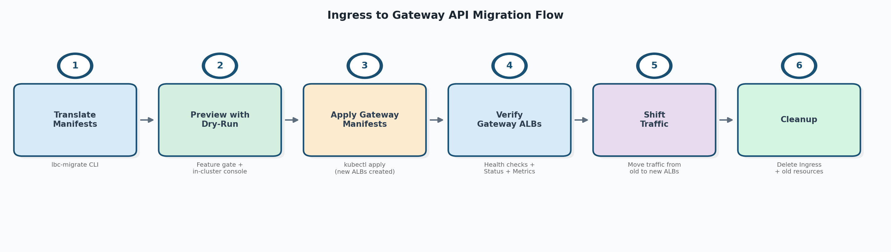
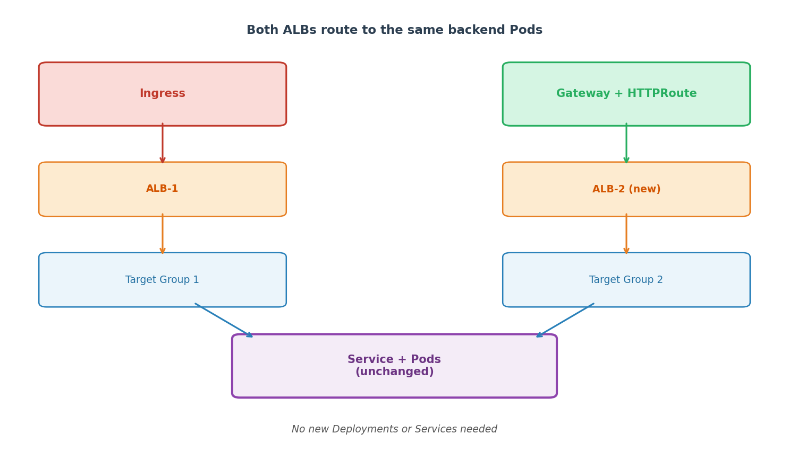
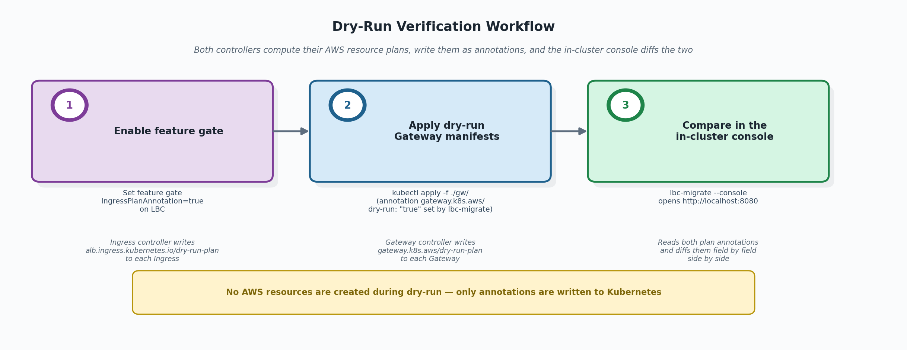

# Migrate from Ingress to Gateway API

This guide covers migrating AWS Load Balancer Controller (LBC) Ingress resources to Gateway API, step by step. The migration is designed to be safe and non-disruptive — new ALBs are created alongside existing ones, so current workloads stay running throughout the process.

Two tools are provided to help:

- **[`lbc-migrate` CLI](lbc_migrate_reference.md)** — translates Ingress manifests (annotations, rules, groups) into equivalent Gateway API YAML.
- **[Migration Console](in_cluster_console.md)** — a local web UI that compares the AWS resource plans produced by both the ingress and gateway controllers field by field, to verify equivalence before applying Gateway manifests for real.

## Overview

The migration follows six steps. Each step is safe to pause at — you can stop and resume at any point.



| Step | Action | What happens | Rollback |
|------|--------|--------------|----------|
| 1 | Translate manifests | `lbc-migrate` converts Ingress YAML to Gateway API YAML | Delete generated files |
| 2 | Preview with dry-run | Ingress controller writes its plan to annotation (requires feature gate). Gateway manifests applied with dry-run — gateway controller writes its plan without creating AWS resources. Console compares both plans. | Delete the dry-run Gateway |
| 3 | Apply Gateway manifests | LBC creates new ALBs for the Gateway resources alongside existing Ingress ALBs | Delete Gateway resources |
| 4 | Verify Gateway ALBs | Confirm new ALBs are healthy, configurations are correct, and metrics look normal | — |
| 5 | Shift traffic | Gradually move traffic from Ingress ALBs to Gateway ALBs | Shift traffic back |
| 6 | Cleanup | Delete Ingress and old resources | — |

!!! important "What changes and what stays the same"
    The generated output **replaces only your Ingress resource**. Everything else stays untouched:

    - **Namespace** — already exists, no changes needed.
    - **Deployment** — unchanged, continues running your application pods.
    - **Service** — unchanged, the new HTTPRoute `backendRefs` reference it by name.



## Prerequisites

- AWS Load Balancer Controller installed in the cluster with Gateway API support enabled
- The [Gateway API CRDs](https://gateway-api.sigs.k8s.io/guides/getting-started/#installing-gateway-api) installed at a compatible version (see [Gateway API documentation](../gateway/gateway.md))
- `lbc-migrate` binary built (see [Installation](lbc_migrate_reference.md#installation))
- The tool assumes input Ingress resources are valid and currently working with the AWS Load Balancer Controller. It does not re-validate Ingress annotations.

### Before you start

Before running `lbc-migrate`, scan your cluster for known limitations and read the relevant reference sections so you don't hit a silent blocker mid-migration:

- **Annotation support** — open the [Annotation Support table](lbc_migrate_reference.md#annotation-support) and confirm none of your in-use annotations are listed as **Not supported** (in particular WAF Classic `waf-acl-id` / `web-acl-id`, and all `frontend-nlb-*`). If they are, resolve them before starting (e.g., migrate WAF Classic to WAFv2).
- **Known differences from Ingress** — review [Known Differences from Ingress](lbc_migrate_reference.md#known-differences-from-ingress), which covers `group.order` priority handling, ALB rule count/priority differences, external Target Group references in `actions.*`, and limited support for some annotations.
- **Cross-namespace IngressGroups** — if any IngressGroup spans multiple namespaces, see [IngressGroup Support](lbc_migrate_reference.md#ingressgroup-support). You must use `--all-namespaces` or list every namespace the group spans; otherwise the tool produces incomplete output.
- **Console RBAC** — ensure the kubeconfig context you will run the migration console with has cluster-wide `list` permission on Gateways and Ingresses. See [Migration Console — RBAC](in_cluster_console.md#rbac).

---

## Step 1: Translate Manifests

First, install the `lbc-migrate` CLI if you haven't already:

```bash
# Build from the aws-load-balancer-controller repo
make lbc-migrate

# (Optional) Install on your PATH
make install-lbc-migrate
```

See [Installation](lbc_migrate_reference.md#installation) for details.

Then run `lbc-migrate` to convert your Ingress resources to Gateway API equivalents.

### Quick start

```bash
# From YAML files
lbc-migrate -f ingress.yaml --output-dir ./gw/

# From a directory of manifests
lbc-migrate --input-dir ./k8s-manifests/ --output-dir ./gw/

# From a live cluster (recommended — automatically fetches referenced Services, IngressClass, etc.)
lbc-migrate --from-cluster --namespaces production --output-dir ./gw/
```

The tool generates Gateway, HTTPRoute, GatewayClass, and optional CRD resources (LoadBalancerConfiguration, TargetGroupConfiguration, ListenerRuleConfiguration).

!!! tip "Use `--from-cluster` for best results"
    File-based input may miss Service-level annotations and IngressClassParams overrides. `--from-cluster` automatically fetches all referenced resources for the most accurate translation.

**Output:** A directory of Gateway API YAML files ready to apply. By default, `--dry-run=true` is set, so the generated Gateway manifests include the `gateway.k8s.aws/dry-run: "true"` annotation.

For the full CLI reference (all flags, output formats, split modes, IngressGroup handling, annotation support table), see **[Migration Tool (lbc-migrate)](lbc_migrate_reference.md)**.

---

## Step 2: Preview with Dry-Run

Before creating any AWS resources, verify that the generated Gateway manifests will produce the same ALB configuration as your current Ingress.



### 2a. Enable the Ingress plan annotation

The `IngressPlanAnnotation` feature gate makes the ingress controller publish its built model stack to each reconciled Ingress as `alb.ingress.kubernetes.io/dry-run-plan`. The in-cluster console reads this annotation. Turn it on by adding the gate to the controller's `--feature-gates` argument:

```
--feature-gates=IngressPlanAnnotation=true
```

If you installed LBC with the official Helm chart, set it through `controllerConfig.featureGates` (the chart converts the map into the `--feature-gates` flag automatically):

```bash
helm upgrade aws-load-balancer-controller eks/aws-load-balancer-controller \
  -n kube-system \
  --reuse-values \
  --set controllerConfig.featureGates.IngressPlanAnnotation=true
```

The Helm upgrade restarts the controller pods automatically. For non-Helm installs (raw manifests, GitOps, etc.) edit the controller Deployment's args and roll the pods. See [Configurations — Feature Gates](../../deploy/configurations.md#feature-gates) for the full feature-gate reference.

Once the controller is running with the gate enabled, the ingress controller writes its built model stack to each reconciled Ingress as `alb.ingress.kubernetes.io/dry-run-plan`.

!!! note "IngressGroup behavior"
    For an IngressGroup, all members share one plan. The controller writes the annotation only to the primary member (lowest `group.order`, tie-broken by lexical `namespace/name`).

### 2b. Apply the generated Gateway manifests

```bash
kubectl apply -f ./gw/gateway-resources.yaml
```

Because the Gateways carry `gateway.k8s.aws/dry-run: "true"`, the gateway controller builds its model but does **not** create an ALB. It writes the plan back to the Gateway as `gateway.k8s.aws/dry-run-plan`. **No AWS resources are created.**

### 2c. Launch the migration console

```bash
lbc-migrate --console
# or bind to a different port
lbc-migrate --console --port 9000
```

Open `http://localhost:8080` in your browser. The console reads both plan annotations and shows a field-by-field comparison of every AWS resource (LoadBalancer, Listeners, ListenerRules, TargetGroups, SecurityGroups) that each controller would create.

The console is read-only and uses your current kubeconfig context — it never modifies any cluster or AWS resources.

Look for:

- **"Changed" diffs** — fields that differ between ingress and gateway plans. Known migration artifacts (naming changes, health-check defaults) are filtered by default.
- **"Added" / "Removed"** — resources or fields present on only one side.

!!! success "When to proceed"
    Review the diffs and confirm they are expected. Some differences are intentional (e.g., you deliberately changed a health-check path). As long as you understand and accept all listed changes, you can proceed to Step 3.

For the full console walkthrough (UI guide, diff classification, export, RBAC, troubleshooting), see **[Migration Console](in_cluster_console.md)**.

### 2d. (Optional) Inspect the raw plan

You can also inspect the plan annotation directly:

```bash
kubectl get gateway my-gateway \
  -o jsonpath='{.metadata.annotations.gateway\.k8s\.aws/dry-run-plan}' | jq .
```

---

## Step 3: Apply Gateway Manifests

Once you've confirmed the dry-run plan matches, you have two equivalent paths to switch the Gateway from dry-run to live. Pick one based on how you manage manifests:

**Option A — regenerate without dry-run (recommended for GitOps).** Produces a clean source-controlled manifest with no `dry-run` annotation:

```bash
# Regenerate without dry-run
lbc-migrate --from-cluster --namespaces production --output-dir ./gw/ --dry-run=false

# Apply
kubectl apply -f ./gw/gateway-resources.yaml
```

**Option B — remove the dry-run annotation in place.** Faster, but the cluster state diverges from your source-controlled YAML until you regenerate:

```bash
kubectl annotate -n <NAMESPACE> gateway <GATEWAY_NAME> gateway.k8s.aws/dry-run-
```

!!! warning "External Target Groups conflict"
    If your Ingress uses `actions.*` annotations that reference an external Target Group, the Gateway ALB cannot attach the same external TG that the Ingress ALB is currently using — only one ALB can own an external TG at a time. See [External Target Group References in Actions](lbc_migrate_reference.md#external-target-group-references-in-actions) for the resolution options before you apply.

**What happens:**

- LBC creates **new ALBs** for the Gateway resources (one per Gateway object)
- LBC creates new Target Groups pointing to the **same** Services/Pods
- Both your existing Ingress ALBs and the new Gateway ALBs now route to the same backend Pods
- Existing Ingress ALBs continue working as before — no disruption

!!! note "Duplicate ALB cost during the migration window"
    Both the original Ingress ALBs and the new Gateway ALBs run in parallel for the duration of Steps 3–5. Expect duplicate ALB-hours and LCU-hours on your AWS bill until you complete cleanup in Step 6.

!!! note "Service reuse"
    Gateway API HTTPRoute `backendRefs` point directly to your existing Kubernetes Services. No new Services, Deployments, or Pods are created. Both sets of ALBs register the same pod IPs.

---

## Step 4: Verify Gateway ALBs

Before shifting traffic, confirm the new Gateway ALBs are healthy and correctly configured.

### Check Gateway status

```bash
kubectl get gateway <GATEWAY_NAME> -n <NAMESPACE>
```

Look for:

- `Programmed: True` condition — the ALB is fully provisioned
- `status.addresses` — contains the new ALB DNS name

### Verify target group health

```bash
# Get the ALB ARN from Gateway status or AWS console
aws elbv2 describe-target-health --target-group-arn <TG_ARN>
```

All targets should show `healthy`.

### Verify ALB configuration

In the AWS Console or via CLI, confirm:

- Listeners match expected ports and protocols
- Security groups are correct
- SSL certificates are attached
- WAF/Shield settings are in place (if applicable)
- Tags are correct

### Monitor metrics

Check CloudWatch metrics for the new ALBs:

- `HealthyHostCount` — all targets registered and healthy
- `HTTPCode_ELB_5XX_Count` — no unexpected 5xx errors
- `TargetResponseTime` — latency within expected range

### Test directly

```bash
# Get Gateway ALB DNS
GATEWAY_ALB=$(kubectl get gateway <GATEWAY_NAME> -n <NAMESPACE> \
  -o jsonpath='{.status.addresses[0].value}')

# Test a request
curl -H "Host: your-app.example.com" http://$GATEWAY_ALB/health
```

!!! warning "Do not skip verification"
    Confirm the new ALBs serve correct responses and all configurations look right before shifting any production traffic.

---

## Step 5: Shift Traffic

After verifying the new Gateway ALBs, shift production traffic from the Ingress ALBs to the Gateway ALBs.

!!! warning "Understand the traffic path before shifting"
    Before changing anything, identify how clients reach the Ingress ALB:

    - Through a custom domain (e.g., `api.example.com`) backed by Route 53 or another DNS provider
    - Directly via the ALB DNS name (e.g., `k8s-default-myingress-abc123...elb.amazonaws.com`)

    If clients use the ALB DNS directly, traffic cannot be shifted without updating every client. Plan accordingly.

The exact mechanism depends on your environment — DNS providers, load balancing services, and client configurations vary. Common considerations include the ability to roll back quickly if issues arise and whether gradual shifting is required for risk management.

For one example of CRD-based traffic management, see the LBC [Global Accelerator](../globalaccelerator/aga-controller.md) documentation.

Refer to your DNS provider or traffic management tooling for specifics.

---

## Step 6: Cleanup

After 100% traffic is on the Gateway ALBs and has been stable for your desired monitoring period:

### Delete the Ingress

```bash
kubectl delete ingress <INGRESS_NAME> -n <NAMESPACE>
```

This triggers LBC to delete the Ingress ALB and its associated Target Groups.

### Delete leftover dry-run Gateways

If in Step 3 you used **Option A** (regenerated without dry-run and applied a fresh manifest), the original dry-run Gateway from Step 2 may still exist alongside the live Gateway. Delete it:


If you used **Option B** (`kubectl annotate` to remove the `dry-run` annotation in place), the same Gateway object is now live — there is nothing extra to delete.

### Disable the `IngressPlanAnnotation` feature gate

If no other migrations are in progress, turn the gate off so the ingress controller cleans up the `dry-run-plan` annotation. With the official Helm chart:

```bash
helm upgrade aws-load-balancer-controller eks/aws-load-balancer-controller \
  -n kube-system \
  --reuse-values \
  --set controllerConfig.featureGates.IngressPlanAnnotation=false
```

For non-Helm installs, drop `IngressPlanAnnotation=true` from the controller's `--feature-gates` argument and roll the pods.

### Clean up traffic management resources

Remove any resources you created in Step 5 to route traffic between the Ingress and Gateway ALBs once they are no longer needed. 

---

## Troubleshooting

For troubleshooting dry-run issues, see [Dry-Run Mode](lbc_migrate_reference.md#dry-run-mode). For console-specific issues, see [Migration Console — Troubleshooting](in_cluster_console.md#troubleshooting).

---

## Further Reading

- **[Migration Tool (lbc-migrate)](lbc_migrate_reference.md)** — full flag reference, annotation support table, output format details
- **[Migration Console](in_cluster_console.md)** — UI walkthrough, diff classification, export, RBAC
- **[Gateway API Overview](../gateway/gateway.md)** — LBC's Gateway API support documentation
- **[Global Accelerator](../globalaccelerator/aga-controller.md)** — AGA CRD for traffic splitting
