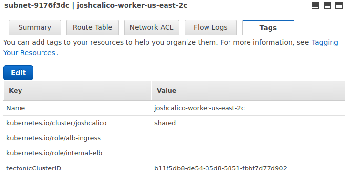

# walkthrough: echoserver

In this walkthrough, you'll

- Create a cluster with EKS
- Deploy an aws-load-balancer-controller
- Create deployments and ingress resources in the cluster
- Use [external-dns](https://github.com/kubernetes-incubator/external-dns) to create a DNS record
    - This assumes you have a route53 hosted zone available. Otherwise you can skip this, but you'll only be able to address the service from the ALB's DNS.

## Create the EKS cluster
1. Install `eksctl`: https://eksctl.io

2. Create EKS cluster via eksctl

    ```bash
    eksctl create cluster
    ```

    ```console
    2018-08-14T11:19:09-07:00 [ℹ]  setting availability zones to [us-west-2c us-west-2a us-west-2b]
    2018-08-14T11:19:09-07:00 [ℹ]  importing SSH public key "/Users/kamador/.ssh/id_rsa.pub" as "eksctl-exciting-gopher-1534270749-b7:71:da:f6:f3:63:7a:ee:ad:7a:10:37:28:ff:44:d1"
    2018-08-14T11:19:10-07:00 [ℹ]  creating EKS cluster "exciting-gopher-1534270749" in "us-west-2" region
    2018-08-14T11:19:10-07:00 [ℹ]  creating ServiceRole stack "EKS-exciting-gopher-1534270749-ServiceRole"
    2018-08-14T11:19:10-07:00 [ℹ]  creating VPC stack "EKS-exciting-gopher-1534270749-VPC"
    2018-08-14T11:19:50-07:00 [✔]  created ServiceRole stack "EKS-exciting-gopher-1534270749-ServiceRole"
    2018-08-14T11:20:30-07:00 [✔]  created VPC stack "EKS-exciting-gopher-1534270749-VPC"
    2018-08-14T11:20:30-07:00 [ℹ]  creating control plane "exciting-gopher-1534270749"
    2018-08-14T11:31:52-07:00 [✔]  created control plane "exciting-gopher-1534270749"
    2018-08-14T11:31:52-07:00 [ℹ]  creating DefaultNodeGroup stack "EKS-exciting-gopher-1534270749-DefaultNodeGroup"
    2018-08-14T11:35:33-07:00 [✔]  created DefaultNodeGroup stack "EKS-exciting-gopher-1534270749-DefaultNodeGroup"
    2018-08-14T11:35:33-07:00 [✔]  all EKS cluster "exciting-gopher-1534270749" resources has been created
    2018-08-14T11:35:33-07:00 [✔]  saved kubeconfig as "/Users/kamador/.kube/config"
    2018-08-14T11:35:34-07:00 [ℹ]  the cluster has 0 nodes
    2018-08-14T11:35:34-07:00 [ℹ]  waiting for at least 2 nodes to become ready
    2018-08-14T11:36:05-07:00 [ℹ]  the cluster has 2 nodes
    2018-08-14T11:36:05-07:00 [ℹ]  node "ip-192-168-139-176.us-west-2.compute.internal" is ready
    2018-08-14T11:36:05-07:00 [ℹ]  node "ip-192-168-214-126.us-west-2.compute.internal" is ready
    2018-08-14T11:36:05-07:00 [✔]  EKS cluster "exciting-gopher-1534270749" in "us-west-2" region is ready
    ```

## Setup the AWS Load Balancer controller
1.  Refer to the [installation instructions](../deploy/installation.md) to setup the controller

1.  Verify the deployment was successful and the controller started.

    ```bash
    kubectl logs -n kube-system $(kubectl get po -n kube-system | egrep -o 'aws-load-balancer-controller[a-zA-Z0-9-]+')
    ```

    Should display output similar to the following.

    ```
    {"level":"info","ts":1602778062.2588625,"logger":"setup","msg":"version","GitVersion":"v2.0.0-rc3-13-gcdc8f715-dirty","GitCommit":"cdc8f715919cc65ca8161b6083c4091222632d6b","BuildDate":"2020-10-15T15:58:31+0000"}
    {"level":"info","ts":1602778065.4515743,"logger":"controller-runtime.metrics","msg":"metrics server is starting to listen","addr":":8080"}
    {"level":"info","ts":1602778065.4536595,"logger":"controller-runtime.webhook","msg":"registering webhook","path":"/mutate-v1-pod"}
    {"level":"info","ts":1602778065.4537156,"logger":"controller-runtime.webhook","msg":"registering webhook","path":"/mutate-elbv2-k8s-aws-v1beta1-targetgroupbinding"}
    {"level":"info","ts":1602778065.4537542,"logger":"controller-runtime.webhook","msg":"registering webhook","path":"/validate-elbv2-k8s-aws-v1beta1-targetgroupbinding"}
    {"level":"info","ts":1602778065.4537594,"logger":"setup","msg":"starting manager"}
    I1015 16:07:45.453851       1 leaderelection.go:242] attempting to acquire leader lease  kube-system/aws-load-balancer-controller-leader...
    {"level":"info","ts":1602778065.5544264,"logger":"controller-runtime.manager","msg":"starting metrics server","path":"/metrics"}
    {"level":"info","ts":1602778065.5544496,"logger":"controller-runtime.webhook.webhooks","msg":"starting webhook server"}
    {"level":"info","ts":1602778065.5549548,"logger":"controller-runtime.certwatcher","msg":"Updated current TLS certificate"}
    {"level":"info","ts":1602778065.5550802,"logger":"controller-runtime.webhook","msg":"serving webhook server","host":"","port":9443}
    {"level":"info","ts":1602778065.5551715,"logger":"controller-runtime.certwatcher","msg":"Starting certificate watcher"}
    I1015 16:08:03.662023       1 leaderelection.go:252] successfully acquired lease kube-system/aws-load-balancer-controller-leader
    {"level":"info","ts":1602778083.663017,"logger":"controller-runtime.controller","msg":"Starting EventSource","controller":"targetGroupBinding","source":"kind source: /, Kind="}
    {"level":"info","ts":1602778083.6631303,"logger":"controller-runtime.controller","msg":"Starting EventSource","controller":"targetGroupBinding","source":"kind source: /, Kind="}
    {"level":"info","ts":1602778083.6633205,"logger":"controller-runtime.controller","msg":"Starting EventSource","controller":"ingress","source":"channel source: 0xc0007340f0"}
    {"level":"info","ts":1602778083.6633654,"logger":"controller-runtime.controller","msg":"Starting EventSource","controller":"ingress","source":"channel source: 0xc000734140"}
    {"level":"info","ts":1602778083.6633892,"logger":"controller-runtime.controller","msg":"Starting EventSource","controller":"ingress","source":"kind source: /, Kind="}
    {"level":"info","ts":1602778083.663441,"logger":"controller-runtime.controller","msg":"Starting EventSource","controller":"ingress","source":"kind source: /, Kind="}
    {"level":"info","ts":1602778083.6634624,"logger":"controller-runtime.controller","msg":"Starting EventSource","controller":"ingress","source":"kind source: /, Kind="}
    {"level":"info","ts":1602778083.6635776,"logger":"controller-runtime.controller","msg":"Starting EventSource","controller":"service","source":"kind source: /, Kind="}
    {"level":"info","ts":1602778083.6636262,"logger":"controller-runtime.controller","msg":"Starting Controller","controller":"service"}
    {"level":"info","ts":1602778083.7634695,"logger":"controller-runtime.controller","msg":"Starting EventSource","controller":"targetGroupBinding","source":"kind source: /, Kind="}
    {"level":"info","ts":1602778083.7637022,"logger":"controller-runtime.controller","msg":"Starting workers","controller":"service","worker count":3}
    {"level":"info","ts":1602778083.7641861,"logger":"controller-runtime.controller","msg":"Starting Controller","controller":"ingress"}
    {"level":"info","ts":1602778083.8641882,"logger":"controller-runtime.controller","msg":"Starting Controller","controller":"targetGroupBinding"}
    {"level":"info","ts":1602778083.864236,"logger":"controller-runtime.controller","msg":"Starting workers","controller":"targetGroupBinding","worker count":3}
    {"level":"info","ts":1602778083.8643816,"logger":"controller-runtime.controller","msg":"Starting workers","controller":"ingress","worker count":3}
    ```

## Deploy the echoserver resources

1.  Deploy all the echoserver resources (namespace, service, deployment)

    ```bash
    kubectl apply -f https://raw.githubusercontent.com/kubernetes-sigs/aws-load-balancer-controller/v2.4.0/docs/examples/echoservice/echoserver-namespace.yaml &&\
    kubectl apply -f https://raw.githubusercontent.com/kubernetes-sigs/aws-load-balancer-controller/v2.4.0/docs/examples/echoservice/echoserver-service.yaml &&\
    kubectl apply -f https://raw.githubusercontent.com/kubernetes-sigs/aws-load-balancer-controller/v2.4.0/docs/examples/echoservice/echoserver-deployment.yaml
    ```

1.  List all the resources to ensure they were created.

    ```bash
    kubectl get -n echoserver deploy,svc
    ```

    Should resolve similar to the following.

    ```console
    NAME             CLUSTER-IP   EXTERNAL-IP   PORT(S)        AGE
    svc/echoserver   10.3.31.76   <nodes>       80:31027/TCP   4d

    NAME                DESIRED   CURRENT   UP-TO-DATE   AVAILABLE   AGE
    deploy/echoserver   1         1         1            1           4d
    ```

## Deploy ingress for echoserver

1.  Download the echoserver ingress manifest locally.

    ```bash
    wget https://raw.githubusercontent.com/kubernetes-sigs/aws-load-balancer-controller/v2.4.0/docs/examples/echoservice/echoserver-ingress.yaml
    ```

1.  Configure the subnets, either by add annotation to the ingress or add tags to subnets. This step is optional in lieu of auto-discovery.

    !!!tip
        If you'd like to use external dns, alter the host field to a domain that you own in Route 53. Assuming you managed `example.com` in Route 53.

    - Edit the `alb.ingress.kubernetes.io/subnets` annotation to include at least two subnets.
        ```bash
        eksctl get cluster exciting-gopher-1534270749
        ```

        ```console
        NAME		                VERSION STATUS         CREATED			VPC						SUBNETS				                SECURITYGROUPS
        exciting-gopher-1534270749	1.10	ACTIVE	2018-08-14T18:20:32Z	vpc-0aa01b07b3c922c9c	subnet-05e1c98ed0f5b109e,subnet-07f5bb81f661df61b,subnet-0a4e6232630820516	sg-05ceb5eee9fd7cac4
        ```

        ```yaml
        apiVersion: networking.k8s.io/v1
        kind: Ingress
        metadata:
            name: echoserver
            namespace: echoserver
            annotations:
                alb.ingress.kubernetes.io/scheme: internet-facing
                alb.ingress.kubernetes.io/target-type: ip
                alb.ingress.kubernetes.io/subnets: subnet-05e1c98ed0f5b109e,subnet-07f5bb81f661df61b,subnet-0a4e6232630820516
                alb.ingress.kubernetes.io/tags: Environment=dev,Team=test
        spec:
            rules:
            - host: echoserver.example.com
                http:
                paths:
        ```

	- Adding tags to subnets for auto-discovery(instead of `alb.ingress.kubernetes.io/subnets` annotation)

	    you must include the following tags on desired subnets.

	    - `kubernetes.io/cluster/$CLUSTER_NAME` where `$CLUSTER_NAME` is the same `CLUSTER_NAME` specified in the above step.
	    - `kubernetes.io/role/internal-elb` should be set to `1` or an empty tag value for internal load balancers.
	    - `kubernetes.io/role/elb` should be set to `1` or an empty tag value for internet-facing load balancers.

	    An example of a subnet with the correct tags for the cluster `joshcalico` is as follows.

	    

1.  Deploy the ingress resource for echoserver

    ```bash
    kubectl apply -f echoserver-ingress.yaml
    ```

1.  Verify the aws-load-balancer-controller creates the resources

    ```bash
    kubectl logs -n kube-system $(kubectl get po -n kube-system | egrep -o 'aws-load-balancer-controller[a-zA-Z0-9-]+') | grep 'echoserver\/echoserver'
    ```

    You should see similar to the following.

    ```console
    {"level":"info","ts":1602803965.264764,"logger":"controllers.ingress","msg":"successfully built model","model":"{\"id\":\"echoserver/echoserver\",\"resources\":{\"AWS::EC2::SecurityGroup\":{\"ManagedLBSecurityGroup\":{\"spec\":{\"groupName\":\"k8s-echoserv-echoserv-4e1e34cae5\",\"description\":\"[k8s] Managed SecurityGroup for LoadBalancer\",\"tags\":{\"Environment\":\"dev\",\"Team\":\"test\"},\"ingress\":[{\"ipProtocol\":\"tcp\",\"fromPort\":80,\"toPort\":80,\"ipRanges\":[{\"cidrIP\":\"0.0.0.0/0\"}]}]}}},\"AWS::ElasticLoadBalancingV2::Listener\":{\"80\":{\"spec\":{\"loadBalancerARN\":{\"$ref\":\"#/resources/AWS::ElasticLoadBalancingV2::LoadBalancer/LoadBalancer/status/loadBalancerARN\"},\"port\":80,\"protocol\":\"HTTP\",\"defaultActions\":[{\"type\":\"fixed-response\",\"fixedResponseConfig\":{\"contentType\":\"text/plain\",\"statusCode\":\"404\"}}]}}},\"AWS::ElasticLoadBalancingV2::ListenerRule\":{\"80:1\":{\"spec\":{\"listenerARN\":{\"$ref\":\"#/resources/AWS::ElasticLoadBalancingV2::Listener/80/status/listenerARN\"},\"priority\":1,\"actions\":[{\"type\":\"forward\",\"forwardConfig\":{\"targetGroups\":[{\"targetGroupARN\":{\"$ref\":\"#/resources/AWS::ElasticLoadBalancingV2::TargetGroup/echoserver/echoserver-echoserver:80/status/targetGroupARN\"}}]}}],\"conditions\":[{\"field\":\"host-header\",\"hostHeaderConfig\":{\"values\":[\"echoserver.example.com\"]}},{\"field\":\"path-pattern\",\"pathPatternConfig\":{\"values\":[\"/\"]}}]}}},\"AWS::ElasticLoadBalancingV2::LoadBalancer\":{\"LoadBalancer\":{\"spec\":{\"name\":\"k8s-echoserv-echoserv-d4d6bd65d0\",\"type\":\"application\",\"scheme\":\"internet-facing\",\"ipAddressType\":\"ipv4\",\"subnetMapping\":[{\"subnetID\":\"subnet-01b35707c23b0a43b\"},{\"subnetID\":\"subnet-0f7814a7ab4dfcc2c\"}],\"securityGroups\":[{\"$ref\":\"#/resources/AWS::EC2::SecurityGroup/ManagedLBSecurityGroup/status/groupID\"}],\"tags\":{\"Environment\":\"dev\",\"Team\":\"test\"}}}},\"AWS::ElasticLoadBalancingV2::TargetGroup\":{\"echoserver/echoserver-echoserver:80\":{\"spec\":{\"name\":\"k8s-echoserv-echoserv-d989093207\",\"targetType\":\"instance\",\"port\":1,\"protocol\":\"HTTP\",\"healthCheckConfig\":{\"port\":\"traffic-port\",\"protocol\":\"HTTP\",\"path\":\"/\",\"matcher\":{\"httpCode\":\"200\"},\"intervalSeconds\":15,\"timeoutSeconds\":5,\"healthyThresholdCount\":2,\"unhealthyThresholdCount\":2},\"tags\":{\"Environment\":\"dev\",\"Team\":\"test\"}}}},\"K8S::ElasticLoadBalancingV2::TargetGroupBinding\":{\"echoserver/echoserver-echoserver:80\":{\"spec\":{\"template\":{\"metadata\":{\"name\":\"k8s-echoserv-echoserv-d989093207\",\"namespace\":\"echoserver\",\"creationTimestamp\":null},\"spec\":{\"targetGroupARN\":{\"$ref\":\"#/resources/AWS::ElasticLoadBalancingV2::TargetGroup/echoserver/echoserver-echoserver:80/status/targetGroupARN\"},\"targetType\":\"instance\",\"serviceRef\":{\"name\":\"echoserver\",\"port\":80},\"networking\":{\"ingress\":[{\"from\":[{\"securityGroup\":{\"groupID\":{\"$ref\":\"#/resources/AWS::EC2::SecurityGroup/ManagedLBSecurityGroup/status/groupID\"}}}],\"ports\":[{\"protocol\":\"TCP\"}]}]}}}}}}}}"}
    {"level":"info","ts":1602803966.411922,"logger":"controllers.ingress","msg":"creating targetGroup","stackID":"echoserver/echoserver","resourceID":"echoserver/echoserver-echoserver:80"}
    {"level":"info","ts":1602803966.6606336,"logger":"controllers.ingress","msg":"created targetGroup","stackID":"echoserver/echoserver","resourceID":"echoserver/echoserver-echoserver:80","arn":"arn:aws:elasticloadbalancing:us-west-2:019453415603:targetgroup/k8s-echoserv-echoserv-d989093207/63225ae3ead3deb6"}
    {"level":"info","ts":1602803966.798019,"logger":"controllers.ingress","msg":"creating loadBalancer","stackID":"echoserver/echoserver","resourceID":"LoadBalancer"}
    {"level":"info","ts":1602803967.5472538,"logger":"controllers.ingress","msg":"created loadBalancer","stackID":"echoserver/echoserver","resourceID":"LoadBalancer","arn":"arn:aws:elasticloadbalancing:us-west-2:019453415603:loadbalancer/app/k8s-echoserv-echoserv-d4d6bd65d0/4b4ebe8d6e1ef0c1"}
    {"level":"info","ts":1602803967.5863476,"logger":"controllers.ingress","msg":"creating listener","stackID":"echoserver/echoserver","resourceID":"80"}
    {"level":"info","ts":1602803967.6436293,"logger":"controllers.ingress","msg":"created listener","stackID":"echoserver/echoserver","resourceID":"80","arn":"arn:aws:elasticloadbalancing:us-west-2:019453415603:listener/app/k8s-echoserv-echoserv-d4d6bd65d0/4b4ebe8d6e1ef0c1/6e13477f9d840da0"}
    {"level":"info","ts":1602803967.6528971,"logger":"controllers.ingress","msg":"creating listener rule","stackID":"echoserver/echoserver","resourceID":"80:1"}
    {"level":"info","ts":1602803967.7160048,"logger":"controllers.ingress","msg":"created listener rule","stackID":"echoserver/echoserver","resourceID":"80:1","arn":"arn:aws:elasticloadbalancing:us-west-2:019453415603:listener-rule/app/k8s-echoserv-echoserv-d4d6bd65d0/4b4ebe8d6e1ef0c1/6e13477f9d840da0/23ef859380e792e8"}
    {"level":"info","ts":1602803967.8484688,"logger":"controllers.ingress","msg":"successfully deployed model","ingressGroup":"echoserver/echoserver"}
    ```

1.  Check the events of the ingress to see what has occur.

    ```bash
    kubectl describe ing -n echoserver echoserver
    ```

    You should see similar to the following.

    ```console
    Name:                   echoserver
    Namespace:              echoserver
    Address:                joshcalico-echoserver-echo-2ad7-1490890749.us-east-2.elb.amazonaws.com
    Default backend:        default-http-backend:80 (10.2.1.28:8080)
    Rules:
      Host                          Path    Backends
      ----                          ----    --------
      echoserver.joshrosso.com
    								/       echoserver:80 (<none>)
    Annotations:
    Events:
      FirstSeen     LastSeen        Count   From                    SubObjectPath   Type            Reason  Message
      ---------     --------        -----   ----                    -------------   --------        ------  -------
      3m            3m              1       ingress-controller                      Normal          CREATE  Ingress echoserver/echoserver
      3m            32s             3       ingress-controller                      Normal          UPDATE  Ingress echoserver/echoserver
    ```

    The address seen above is the ALB's DNS record. This will be referenced via records created by external-dns.


## Setup external-DNS to manage DNS automatically

1.  Ensure your nodes (on which External DNS runs) have the correct IAM permission required for external-dns. See https://github.com/kubernetes-incubator/external-dns/blob/master/docs/tutorials/aws.md#iam-permissions.

1.  Download external-dns to manage Route 53.

    ```bash
    wget https://raw.githubusercontent.com/kubernetes-sigs/aws-load-balancer-controller/v2.4.0/docs/examples/external-dns.yaml
    ```

1.  Edit the `--domain-filter` flag to include your hosted zone(s)

    The following example is for a hosted zone test-dns.com

    ```yaml
    args:
    - --source=service
    - --source=ingress
    - --domain-filter=test-dns.com # will make ExternalDNS see only the hosted zones matching provided domain, omit to process all available hosted zones
    - --provider=aws
    - --policy=upsert-only # would prevent ExternalDNS from deleting any records, omit to enable full synchronization
    ```

1.  Deploy external-dns

    ```bash
    kubectl apply -f external-dns.yaml
    ```

1.  Verify the DNS has propagated

    ```bash
    dig echoserver.josh-test-dns.com
    ```

    ```console
    ;; QUESTION SECTION:
    ;echoserver.josh-test-dns.com.  IN      A

    ;; ANSWER SECTION:
    echoserver.josh-test-dns.com. 60 IN     A       13.59.147.105
    echoserver.josh-test-dns.com. 60 IN     A       18.221.65.39
    echoserver.josh-test-dns.com. 60 IN     A       52.15.186.25
    ```

1.  Once it has, you can make a call to echoserver and it should return a response payload.

    ```bash
    curl echoserver.josh-test-dns.com
    ```

    ```console
    CLIENT VALUES:
    client_address=10.0.50.185
    command=GET
    real path=/
    query=nil
    request_version=1.1
    request_uri=http://echoserver.josh-test-dns.com:8080/

    SERVER VALUES:
    server_version=nginx: 1.10.0 - lua: 10001

    HEADERS RECEIVED:
    accept=*/*
    host=echoserver.josh-test-dns.com
    user-agent=curl/7.54.0
    x-amzn-trace-id=Root=1-59c08da5-113347df69640735312371bd
    x-forwarded-for=67.173.237.250
    x-forwarded-port=80
    x-forwarded-proto=http
    BODY:
    ```

## Kube2iam setup
follow below steps if you want to use kube2iam to provide the AWS credentials

1. configure the proper policy
    The policy to be used can be fetched from https://raw.githubusercontent.com/kubernetes-sigs/aws-load-balancer-controller/v2.4.0/docs/install/iam_policy.json

1. configure the proper role and create the trust relationship
    You have to find which role is associated with your K8S nodes. Once you found take note of the full arn:

    ```
    arn:aws:iam::XXXXXXXXXXXX:role/k8scluster-node
    ```

1. create the role, called k8s-lb-controller, attach the above policy and add a Trust Relationship like:

    ```
    {
      "Version": "2012-10-17",
      "Statement": [
        {
          "Sid": "",
          "Effect": "Allow",
          "Principal": {
            "Service": "ec2.amazonaws.com"
          },
          "Action": "sts:AssumeRole"
        },
        {
          "Sid": "",
          "Effect": "Allow",
          "Principal": {
            "AWS": "arn:aws:iam::XXXXXXXXXXXX:role/k8scluster-node"
          },
          "Action": "sts:AssumeRole"
        }
      ]
    }
    ```

    The new role will have a similar arn:

    ```
    arn:aws:iam:::XXXXXXXXXXXX:role/k8s-lb-controller
    ```

1.  update the alb-load-balancer-controller deployment

    Add the annotations in the template's metadata point

    ```yaml
    spec:
    replicas: 1
    selector:
    matchLabels:
      app.kubernetes.io/component: controller
      app.kubernetes.io/name: aws-load-balancer-controller
    strategy:
      rollingUpdate:
        maxSurge: 1
        maxUnavailable: 1
      type: RollingUpdate
    template:
      metadata:
        annotations:
          iam.amazonaws.com/role: arn:aws:iam:::XXXXXXXXXXXX:role/k8s-lb-controller
    ```
